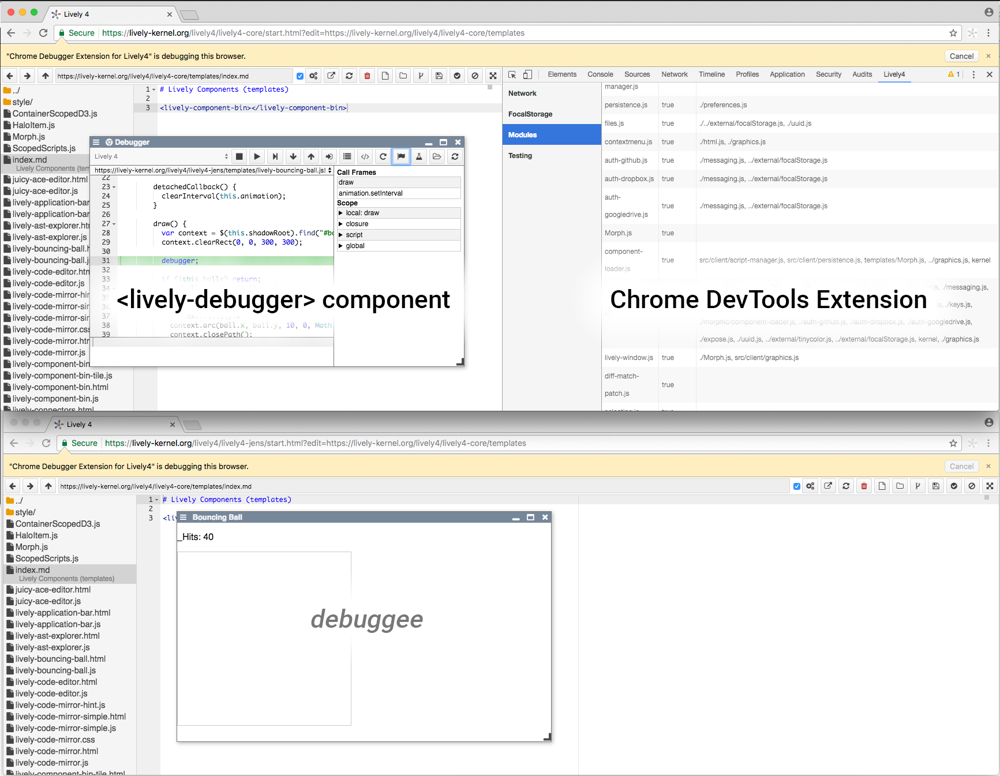

# Project 3: Fabio Niephaus, Sebastian Koall  *Abstraction-aware Debugging*

[**repo:** lively4-chrome-debugger](https://lively-kernel.org/lively4/lively4-chrome-debugger/README.md) [**ideas**](ideas.md)

The Lively4 Chrome Debugger aims to provide a scriptable debugger for Lively4. It consists of two parts: a Chrome extension and a `<lively-debugger>` component for Lively4. The extension exposes a lively4ChromeDebugger object in the Lively4 page context in order to provide access to the chrome.* APIs, which are required by the debugger UI. Also, it allows to evaluate code in all currently available contexts (content script, background page, Chrome DevTools, and Lively4 panel in Chrome DevTools).

The main task of the object is to expose the chrome.debugger API and offer convenience methods for functions like getting all debug targets or attaching the debugger to a page. Furthermore, the object is able to send generic commands to the chrome API in order to access the whole range of functions available through the interface. Every call returns a Promise, which contains the execution result after the asynchronous request has completed.

The debugger can be accessed from the Lively4 context menu. After selecting a debuggee, standard debugging buttons like step into and step over are available. Any command can be executed automatically, a chosen number of times at a given step speed. Additionally, it is possible to control the debugger with an interactive Debugger workspace. Users can also edit code live at runtime, without having to reload the page. Lastly, the debugger also provides access to Chrome's profiler.

<video controls><source src="screencast.mp4" type="video/mp4"></video>