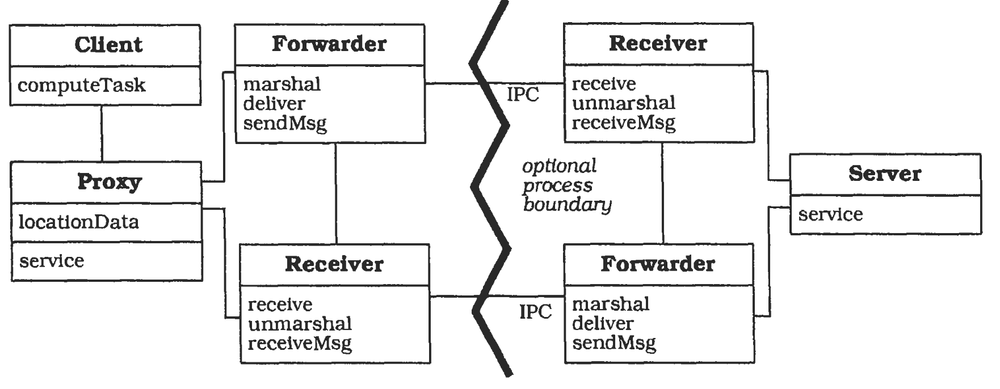

<!-- markdown-config presentation=true -->

   Software Design Seminar

  <u>Jens Lincke</u>, Stefan Ramson, Tom Beckmann, Robert Hirschfeld

    Software Architecture Group  Hasso Plattner Institute  University of Potsdam, Germany 
    2021

---

# Topics 

- B-Splines and Friends #Stefan
- Parser Combinators #Stefan
- Daten- und Kontrolflussgraphen #Stefan

---

## ideas from programming conference

- Island Parsers?

----
## Edge Bundling

- @Stefan

