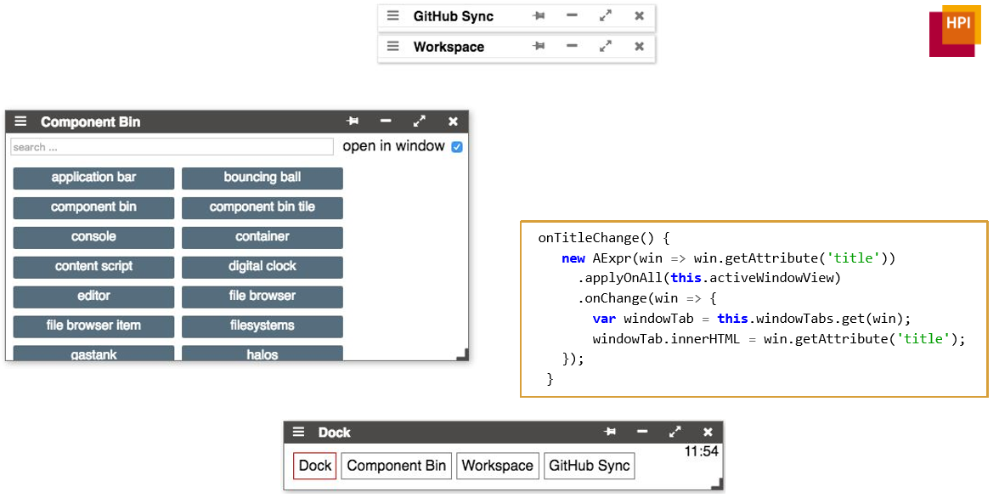

# WebDev 2016   HPI Seminar on evolving the Lively4  Web-based Development Environment

<lively-import src="../_navigation.html"></lively-import>

<link rel="stylesheet" type="text/css" href="../seminars.css" />

[**Topics Slides**](WebDev16.pdf)

- [Project 1](project_1/index.md)   Jan Graichen, Meike Baumgaertner  *Cache*  {.thumb} {.project .lively4}
- [Project 2](project_2/index.md)   Daniel Stolpe, Yannis Kommana  *RDF*   {.thumb} {.project .lively4}
-	[Project 3](project_3/index.md)   Daniel Werner, Felix Wolff  *Indexing*   {.thumb} {.project .lively4}
- [Project 4](project_4/index.md)   Fabio Niephaus, Philipp Otto  *Services*   {.thumb} {.project .lively4}
- [Project 5](project_5/index.md)   Jakob Reschke,  Marianne Thieffry  *COP* {.thumb} {.project .lively4}
- [Project 6](project_6/index.md)   Timo Djuerken, Philipp Pajak  *AExpr*  {.thumb} {.project .lively4}

<lively-import src="../_logo.html"></lively-import>
<lively-import src="../_footer.html"></lively-import>