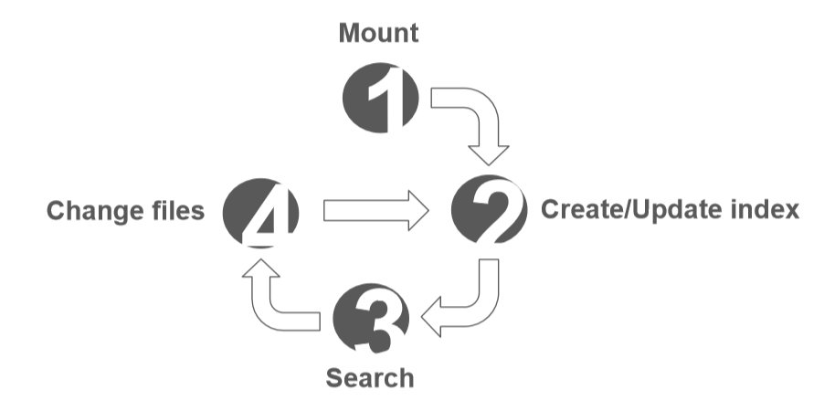

# Daniel Werner, Felix Wolff -- Indexing: Personal Cloud Search

[presentation](presentation.pdf)

## Background: 
- Hard to search find private content and code

## Problem: 
- Cannot use public search services for private data

## Idea: 
- Search private data on cloud storages and services – Persist index on private services, cloud storage, or web browser

## Related work: 
- http://lunrjs.com/ 
- https://github.com/fergiemcdowall/search-index

## Goal: 
- Provide instant code search in lively tools – Provide navigation between #tags in private content