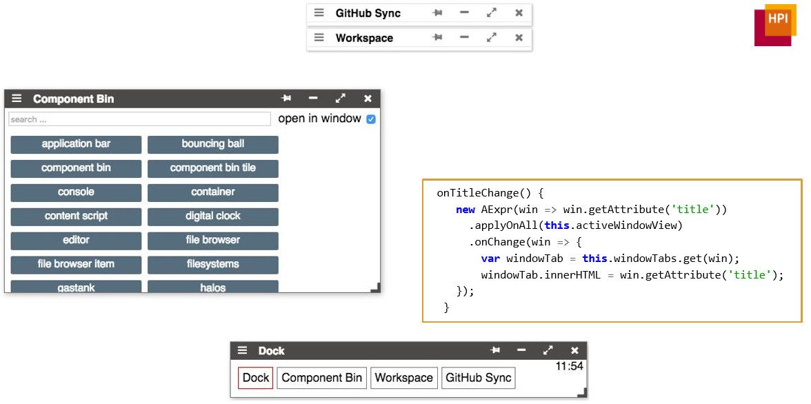

# Project 6: Timo Djürken, Philipp Pajak	<br> *AExpr: Active Expressions*

<lively-import src="../_navigation.html"></lively-import>

[presentation](presentation.pdf)



## Background: Using imperative JavaScript to 
- Derive declarative constraint descriptions (OCP)
- Derive groups of objects

## Example: 

```JS
select(Morph, m => m.color === ‘green’)
```

## Goal: 
- Extract active expressions into reusable library 
- Extend library to track DOM changes 
- Example Application: Visual debug information for object groups