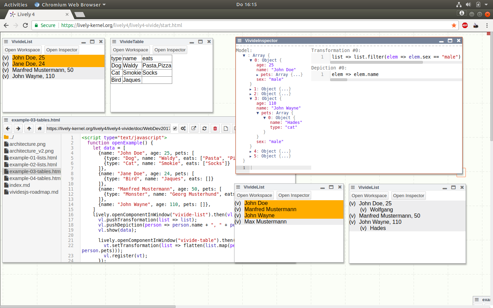
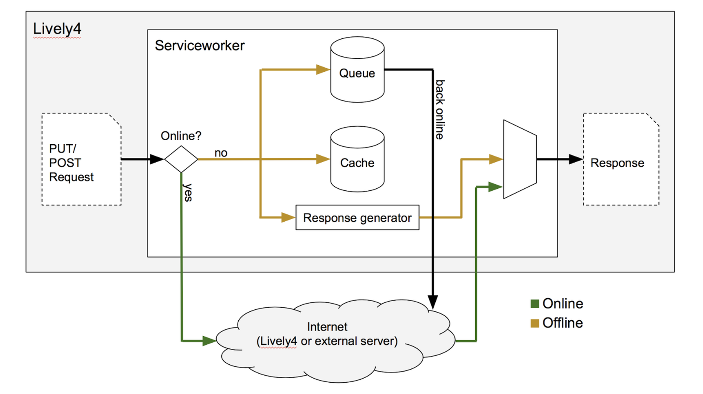
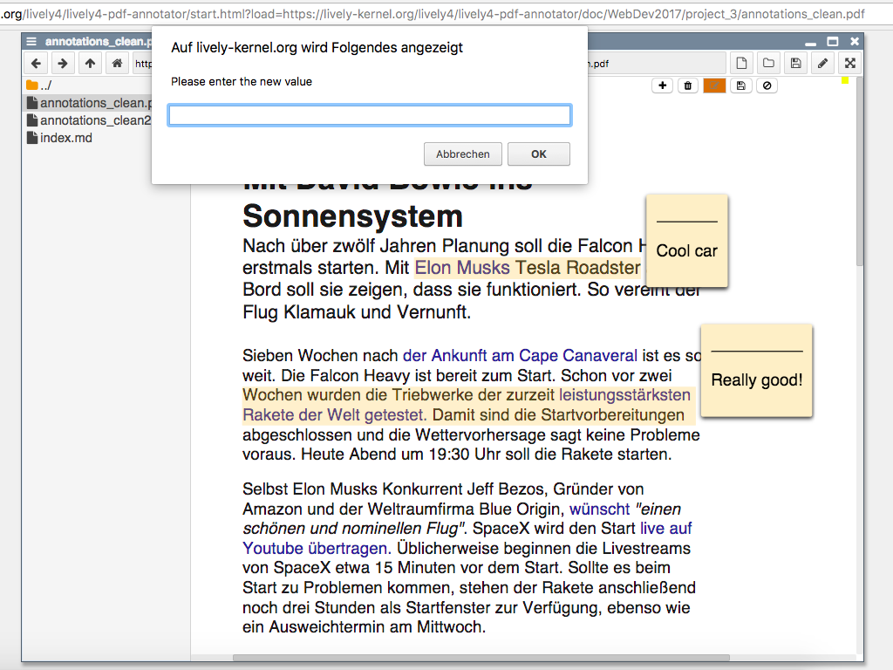
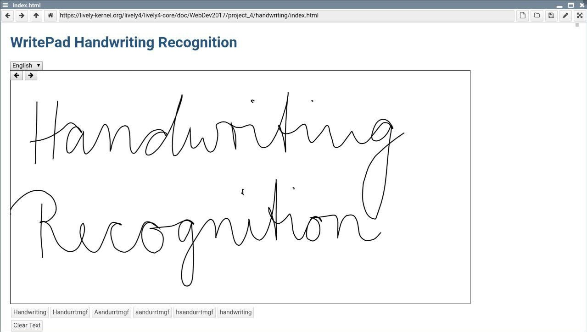
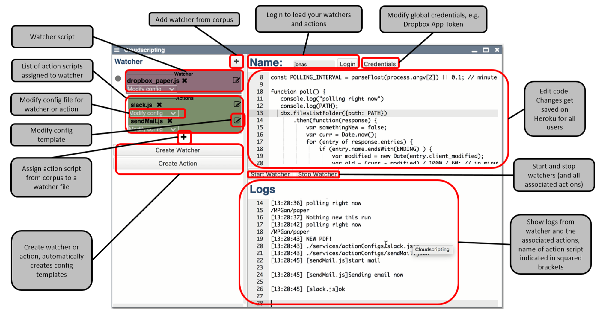
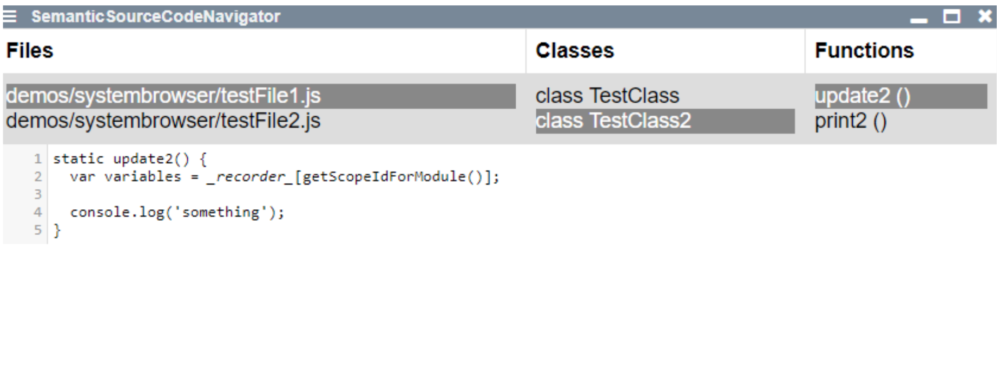
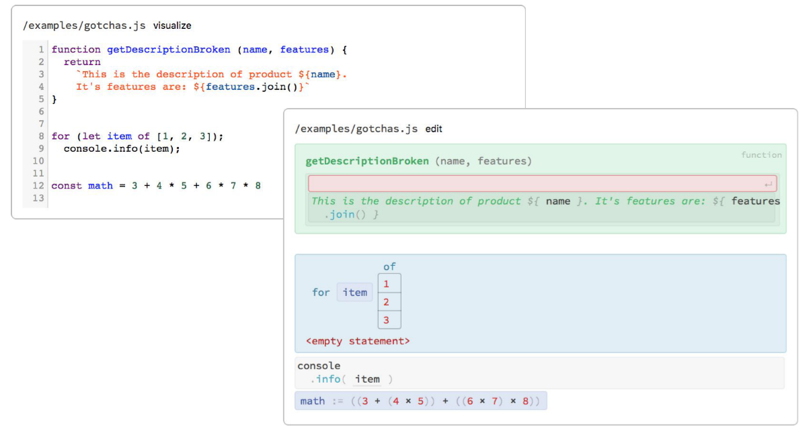

# WebDev 2017 Seminar, HPI

<lively-import src="../_navigation.html"></lively-import>

[**Topics Slides**](WebDev1718.pdf)

- [Project 1](project_1/index.md)  Jonas Chromik   *Vivide/JS*   {.thumb} {.project .lively4}
- [Project 2](project_2/index.md)  David Rauch, Sebastian Koall   *Offline First*   {.thumb} {.project .lively4}
- [Project 3](project_3/index.md)  Henriette Dinger, Sebastian Kliem   *PDF Annotator*    {.thumb} {.project .lively4}
- [Project 4](project_4/index.md)  Toni Stachewicz, Niklas Hoffmann   *Handwriting Recognition*   {.thumb} {.project .lively4}
- [Project 5](project_5/index.md)  Jonas Keutel, Cornelius Hagmeister   *Scripting Cloud Data Flow*    {.thumb} {.project .lively4}
- [Project 6](project_6/index.md)   Siegfried Horschig, Theresa Zobel   *Semantic Source Code Navigation*   {.thumb} {.project .lively4}
- [Project 7](project_7/index.md)  Marcel Jankrift, Benjamin Feldmann   *Lively4 App*   {.thumb} {.project .lively4}
- [Project 8](project_8/index.md)  Adrian Sieber    *Projectional Editing*   {.thumb} {.project .lively4}

<lively-import src="../_logo.html"></lively-import>
<lively-import src="../_footer.html"></lively-import>