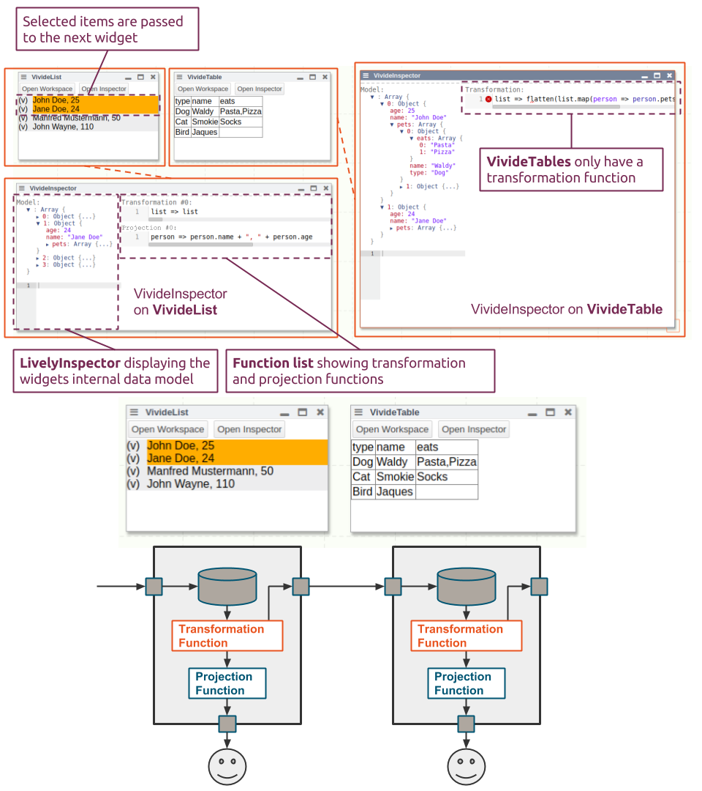

# Gruppe 1: Jonas Chromik - VivideJS

- [presentation](VivideJS.pdf)

## Abstract

VivideJS aims at being a proof-of-concept implementation of Vivide (originally implemented in Squeak/Smalltalk).
Due to time restrictions we were not able to implement all features of Vivide.
Also, we can not provide the polished user experience.

We implemented the following features:
 - A concept of widgets, taking, storing and displaying data
 - A data manipulation concept distinguishing between
     - functions manipulating the internal data representation (transformations) and
     - functions manipulation the way of displaying data (depictions)
 - A concept of data flow between widgets, whereas the downstream widget is updated when the upstream widget is changed
 - Two widgets obeying these concepts: VivideList and VivideTable
 - VivideInspector, a tool for displaying and manipulating data and functions in a widget
 - Integration into Lively (e.g. by using templates, reusing LivelyTable, or providing an "open workspace" button)

Further work is various and includes polishing the user interface for providing a better usage experience.
Also we could work on concepts like displaying infinite, recursively defined lists,
provide more tooling on widgets or streamed data access.
As the project grows and interfaces become definite, tests become significantly more important.

## Screencast

<video autoplay controls><source src="screencast.mp4" type="video/mp4"></video>

## Proposal

- Resources
  - Vivide Tutorial Videos
  - Vivide Paper
  - Marcel
- Humans to talk to
  - Marcel (Theory, Dataflow, Tangible Objects)
  - Patrick (Use Case Driven, Big Picture)
  - Stefan (Polishment, no explorability)
- Start with **real data**:
  - [Lively4 SystemJS Modules](https://lively-kernel.org/lively4/lively4-core/templates/lively-module-graph.js)
  - your dropbox/google drive

