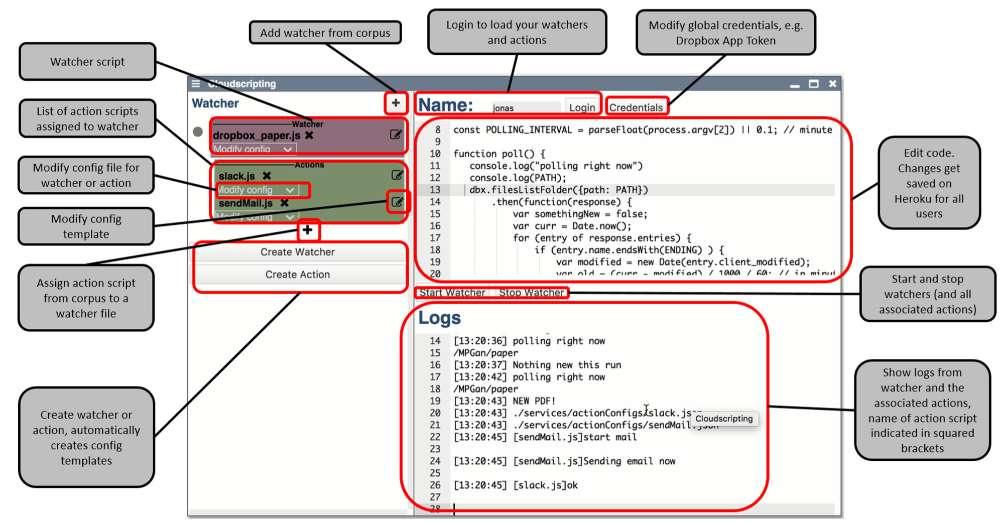

# Project 5: Jonas Keutel, Cornelius Hagmeister - Lively4 Cloud Scripting


[presentation](presentation.pdf)

## Abstract

Automating things has always been a motivation for software developers. Popular services like IFTTT (If This Then That) brought this into mainstream, enabling everyone to automate certain workflows like “If I listen to a song on my Amazon Echo, append the name of the song to a Google Doc” or “Whenever the NASA publishes a new picture, set it as my smartphone background image”. However, all of these services only provide a certain set of services you can use and connect, and have a limited way of customizability. 




With *Lively4 Cloudscripting* we developed a service on Lively4 that allows you to run arbitrary scripts on a Heroku server that you either wrote yourself or selected from a corpus of scripts provided by other developers. These scripts are divided into *watchers* and *actions*. Watchers are supposed to be run in an interval of several seconds or minutes and watch a certain service (e.g. Dropbox) for certain changes (e.g. a new PDF file in the PhD/papers folder). For what exactly the watcher should be looking can be set in the configuration. 
When a change is detected, the `runActions()` call gets executed. This is a keyword that the Cloudscripting backend takes care of and executes all the *action* scripts that are associated with the watcher file. An *action* script can make use of parameters passed from *watcher* scripts as well as from values passed in via the configuration file.  

## Screencast

<video controls><source src="screencast.mp4" type="video/mp4"></video>


## Project Description

Scripting Cloud Data Flow: Schaut euch (kurz) einige existierende Systeme an(diese sind konfigurationssystemem, keine script-umgebungen)
- IfThisThanThat (e.g. [Dropbox](https://ifttt.com/dropbox)/[Trello](https://ifttt.com/trello)/[Github](https://ifttt.com/github)) (uses polling)
- Yahoo! Pipes
- Apple Automator

Recent student Project: [Lively Services](https://lively-kernel.org/lively4/lively4-core/templates/lively-services.js) (Fabio Niephaus)

- REST plumbing
  - Task: change events from remote storages (currently, we support file access for google drive, dropbox, github)
  - provide simple dataflow model, or something similar, to script on those changes
  - codify the following:
  
```
(1) When a new '.pdf' file is in my dropbox folder 'PhD/papers'
(2) Search for its '.bibtex' data on google scholar
(3) Append that data to 'references.bib' in the dropbox folder
(4) And rename the file to '%author_%year_%title'
```

- Alternative: can we integrate with those meta services?
