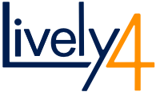

<lively-import src="./_logo.html"></lively-import>

# hpi-swa {style="position:relative; height: 60px; top: 20px"} Seminar Wiki

- 2021
  - [SWD 2021 Essays Again Edition](SWD2021/)
  - [Live Programming 2021](Live2021/)
- 2020
  - [PLCTE 2020](PLCTE2020/)
  - [EUD 2020  - End-user Development Seminar](EUD2020/)
- 2019
  - [SWD 2019  - End-user Development Seminar (Smalltalk Edition)](SWD2019)
  - [PX 2019 - Programming Experience Seminar](PX2019/)
  - [RP 2019  - Reactive Programming Seminar](RP2019/)
- 2018
  - [PX 2018 - Programming Experience Seminar](PX2018/)
  - [RE 2018 - Reverse Engineering Seminar](RE2018/)
  - [RP 2018  - Reactive Programming Seminar](RP2018/)
- 2017
  - [WebDev 2017 - Web-based Devlopment Environments Seminar](WebDev2017/)
  - [WebDev 2016 - Web-based Devlopment Environments Seminar](WebDev2016/)
- 2016
  - [SWD 2016 - Software Design Seminar/](SWD2016/)
- 2015
  - [SWD 2015 - Software Design Seminar](SWD2015/)

<lively-import src="./_footer.html"></lively-import>